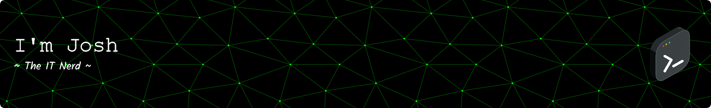

🌎 Currently located in Michigan, US.

🚀 I am working on mainly personal projects to automate my workflow.

🔗 Take a look at my tech blog, [rossjm.dev](https://rossjm.dev).

### 🔎 Find Me

[Email](mailto:josh@rossjm.dev) • [LinkedIn](https://www.linkedin.com/in/joshuamalcom/) • [Twitter/X](https://twitter.com/ColoredBytes)

## 🛠️ My Languages and Tools

### Scripting Languages

  
  
  

### Databases and Hosting

  
  
  
  
  
  
  

### Software 

  
  
  
  
  

